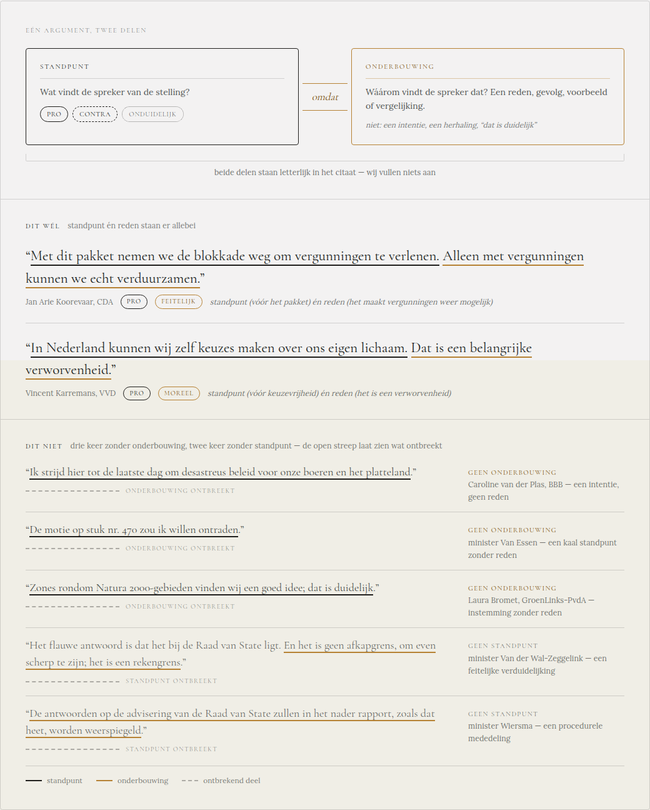

# Visuele ondersteuning definitie van een argument

Ontwerp voor issue #89 (about-pagina, sectie "Wat telt als argument?"), opgeleverd
2026-08-15.

## Overzicht

Twee onderdelen:

1. **Schema** -- Standpunt en Onderbouwing als twee blokken, verbonden door "omdat".
   Standpunt krijgt de drie standpunt-varianten (Pro/Contra/Onduidelijk) als randstijl
   (doorgetrokken/gestippeld/gestipt), Onderbouwing een korte toelichting plus een
   "niet:"-regel (intentie, herhaling, "dat is duidelijk"). Onderschrift: "beide delen
   staan letterlijk in het citaat -- wij vullen niets aan".
2. **Dezelfde markering toegepast op de echte about-pagina-voorbeelden**: het aanwezige
   deel van het citaat krijgt een onderstreping (ink voor standpunt, accentkleur voor
   onderbouwing), het ontbrekende deel een losse gestippelde streep met label
   ("onderbouwing ontbreekt" / "standpunt ontbreekt"). Een legenda onderaan verklaart de
   drie streeptypes.

De citaten in het ontwerp zijn letterlijk de vijf "dit niet"- en twee "dit
wél"-voorbeelden die al in `frontend/src/pages/about.astro` staan (regels 206-272 t.t.v.
dit ontwerp) -- geen nieuwe voorbeelden, alleen een visuele laag erbovenop.

## Wat hier niet is overgenomen

Het interactieve `.dc.html`-prototype waarmee dit is opgeleverd (eigen "dc-runtime",
laadt React via een CDN -- geen productiecode) en het "Classical" design system
(`_ds/`-map) zijn niet overgenomen, zelfde afweging als bij
[`argumentenboom/`](../argumentenboom/) en [`videoplayer/`](../videoplayer/): de
implementatie gebruikt de bestaande site-tokens uit `frontend/src/styles/main.css`
(`--color-text` voor standpunt, `--color-accent` voor onderbouwing) in plaats van een
eigen kleur-/lettertypesysteem.

Zie [#89](https://github.com/SiggyF/bipolariteit/issues/89).
