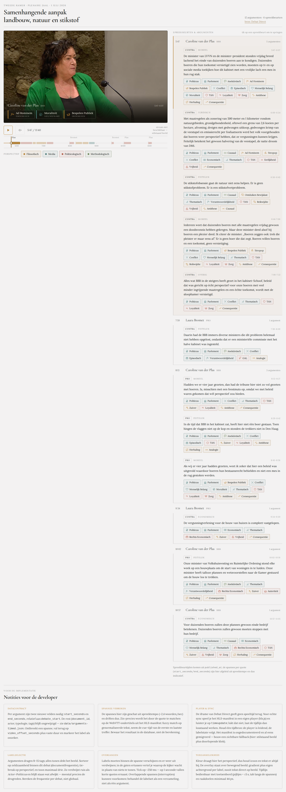
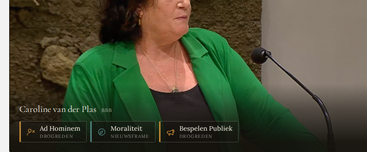
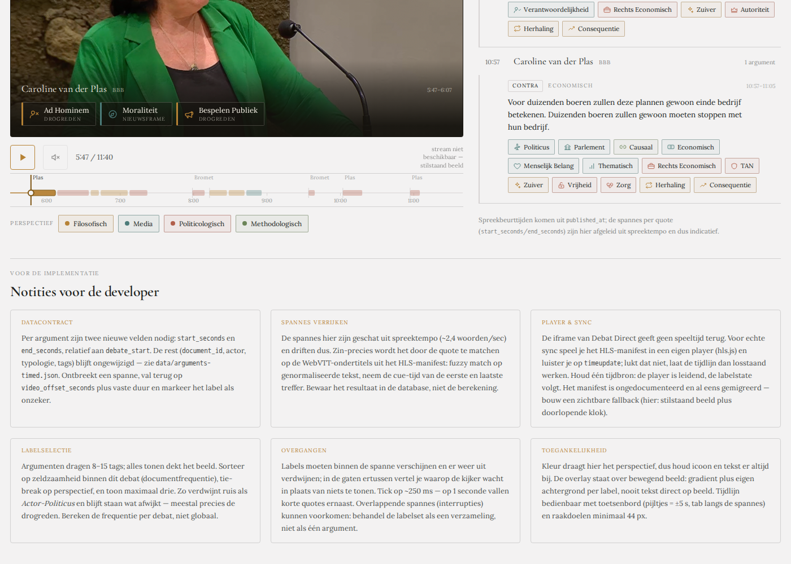

# Video-annotaties met argumenttypen

Ontwerp voor issue #94 (visuele annotaties op een geëmbed debat), opgeleverd 2026-08-13
nadat het technisch onderzoek in
[docs/tk-data-sources-overview.md](../../tk-data-sources-overview.md) (secties 5a/5b)
en de PoC in [docs/poc/video-eigen-player/](../../poc/video-eigen-player/) als
uitgangspunt zijn meegegeven. Input was
[docs/poc/video-eigen-player/sample-arguments.json](../../poc/video-eigen-player/sample-arguments.json)
(echte argumenten/tags voor het stikstofdebat van 1 juli 2026).

## Overzicht

Video links, met:
- een lower-third naamplaatje (spreker + partij)
- tot drie tag-badges die overlayen tijdens de bijbehorende quote (icoon + tagnaam +
  categorie, bv. "Ad Hominem — DROGREDEN")
- een tijdlijn met per-quote-markers, gegroepeerd per spreekbeurt, gekleurd op
  perspectief (dezelfde vier perspectieven als
  [`tag-iconografie/`](../tag-iconografie/): Filosofisch, Media, Politicologisch,
  Methodologisch)

Rechts een doorlopende "Spreekbeurten & Argumenten"-lijst (vergelijkbaar met Debat
Direct's eigen "Spreekmomenten"-paneel, zie sectie 5a) met per argument de volledige
tagset als pills, klikbaar om naar dat moment te springen.

## Notities voor de developer (uit het ontwerp, letterlijk overgenomen)

**Datacontract**
Per argument zijn twee nieuwe velden nodig: `start_seconds` en `end_seconds`, relatief
aan `debate_start`. De rest (`document_id`, `actor`, `typologie`, `tags`) blijft
ongewijzigd — zie [`arguments-timed.json`](arguments-timed.json). Ontbreekt een spanne,
dan is er noch een events-anker, noch een debat-brede VTT-kalibratie voor dit debat
gelukt (zie hieronder) — zeldzaam, maar dan verdwijnt het argument uit de tijdlijn i.p.v.
een gegokte spanne te tonen.

**Spannes verrijken** (issue #94, uitgebreid in #130 met een exact per-beurt-anker)
Twee tiers, zie `pipeline/match_argument_spans.py` en
[`docs/tk-data-sources-overview.md` 5f](../../tk-data-sources-overview.md):
1. **Events-anker per sprekerbeurt** (primair): Debat Direct's eigen
   `events`-array (`docs/tk-data-sources-overview.md` 5f) geeft een exacte,
   drift-vrije wandklok-tijd per beurtwissel, gekoppeld via de TK-Persoon-GUID
   (`documents.speaker_person_id`, byte-identiek aan `events[].objectId`).
2. **WebVTT-ondertitelmatching** (verfijning binnen de beurt): de quote wordt
   fuzzy gematcht op genormaliseerde tekst tegen de WebVTT-ondertitels uit het
   HLS-manifest (zoals eerder, zie [de PoC](../../poc/video-eigen-player/poc_ownplayer.html),
   via `video.textTracks`), maar nu gekalibreerd op het events-anker van déze
   beurt i.p.v. op een mediaan voor het hele debat — dat voorkomt dat
   tikvertraging/drift in één beurt de spannes van andere beurten scheeftrekt.
   Levert geen enkele quote in een geankerde beurt een VTT-match op, dan valt
   de hele beurt terug op het anker zelf plus een spreektempo-schatting van de
   duur (~2,4 woorden/sec, zelfde schatting als `arguments-timed.json`).
   Debatten zonder events-anker (geen `fetch-debate-events`-cache) vallen
   volledig terug op de oorspronkelijke aanpak: één mediane VTT-kalibratie
   voor het hele debat. Bewaar het resultaat in de database, niet de
   berekening.

**Player & sync**
De iframe van Debat Direct geeft geen speeltijd terug (bevestigd in sectie 5a). Voor
echte sync speel je het HLS-manifest in een eigen player (hls.js) en luister je op
`timeupdate`; lukt dat niet, laat de tijdlijn dan losstaand werken. Houd één tijdbron:
de player is leidend, de labelstate volgt. Het manifest is ongedocumenteerd en al eens
gemigreerd (sectie 5b) — bouw een zichtbare fallback (hier: stilstaand beeld plus
doorlopende klok).

**Labelselectie**
Argumenten dragen 8-15 tags; alles tonen dekt het beeld. Sorteer op zeldzaamheid binnen
dit debat (documentfrequentie), tie-break op perspectief, en toon maximaal drie. Zo
verdwijnt ruis als `Actor-Politicus` en blijft staan wat afwijkt — meestal precies de
drogreden. Bereken de frequentie per debat, niet globaal.

**Overgangen**
Labels moeten binnen de spanne verschijnen en er weer uit verdwijnen; in de gaten
ertussen vertel je waarop de kijker wacht in plaats van niets te tonen. Tick op ~250ms —
op 1 seconde vallen korte quotes ernaast. Overlappende spannes (interrupties) kunnen
voorkomen: behandel de labelset als een verzameling, niet als één argument.

**Toegankelijkheid**
Kleur draagt hier het perspectief, dus houd icoon en tekst er altijd bij. De overlay
staat over bewegend beeld: gradient plus eigen achtergrond per label, nooit tekst direct
op beeld. Tijdlijn bedienbaar met toetsenbord (pijltjes = ±5s, tab langs de spannes) en
raakdoelen minimaal 44px.

## Wat hier niet is overgenomen

Het interactieve `.dc.html`-prototype waarmee dit is opgeleverd (eigen "dc-runtime",
laadt React via een CDN — geen productiecode) is niet overgenomen, zelfde reden als bij
[`argumentenboom/`](../argumentenboom/). `arguments-timed.json` is wel behouden: dat is
een echt, herbruikbaar voorbeeld van de databasevelden (`start_seconds`/`end_seconds`)
die het datacontract hierboven vraagt.

Het "Classical" design system (`_ds/`-map in de oorspronkelijke oplevering) is hier niet
overgenomen — zelfde afweging als bij `argumentenboom/classical-design-system-readme.md`:
een eventuele implementatie gebruikt de bestaande site-tokens uit
`frontend/src/styles/main.css`, niet een eigen kleur-/lettertypesysteem.

Zie [#93](https://github.com/SiggyF/bipolariteit/issues/93) en
[#94](https://github.com/SiggyF/bipolariteit/issues/94).
