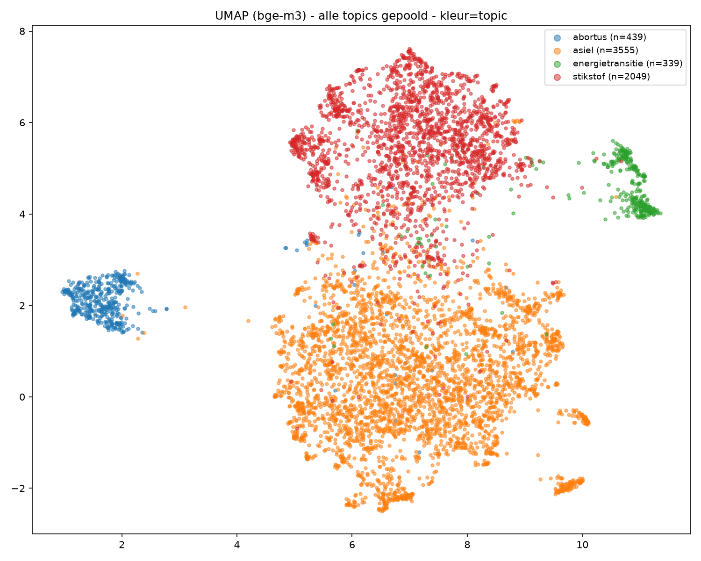

# Onderzoekje UMAP-visualisatie argumenten (issue #156)

Script: [`scripts/experiment_umap_arguments.py`](../../../scripts/experiment_umap_arguments.py).
Niet geïntegreerd in de pipeline -- puur een steekproef om te zien of dit iets
zinnigs oplevert.

## Opzet

- Topic: asiel (3555 argumenten, `quote_text`, min. 30 tekens).
- Token-based: TF-IDF (1-2-grams, NLTK Nederlandse stopwoorden, `min_df=2`),
  vocab 16.487 termen, vectorize+UMAP in ~101-113s.
- Embedding-based (nomic): LM Studio, `text-embedding-nomic-embed-text-v1.5`
  (overwegend Engels getraind), embeddings+UMAP in ~67s.
- Embedding-based (bge-m3): LM Studio, `BAAI/bge-m3` (gpustack GGUF, Q8_0),
  expliciet multilingual. Eerst geprobeerd via `sentence-transformers` lokaal
  in de devcontainer (CPU-only, ~27min projectie voor 3555 quotes -- geen
  GPU-doorgifte van de macOS-host naar de Linux-devcontainer, `torch.backends
  .mps.is_built()` is `False` op dat pad); vervolgens overgestapt op hetzelfde
  LM Studio-/v1/embeddings-endpoint als nomic, zodat het model op de
  host-GPU draait -- veel sneller.
- Kleuring op vier dimensies, voor alle drie varianten (12 PNG's in deze
  map): `stance`, `partij`, `stijl` (alfabetisch eerste Stijlmiddelen-tag,
  labelgroep "Stijlmiddelen", `geen` als er geen is toegekend -- 476/3555
  argumenten hebben er minstens één) en `drogreden` (idem voor labelgroep
  "Dialectische Kwaliteit" / Drogreden-*-tags, 159/3555). Bij argumenten met
  meerdere Stijl-/Drogreden-tags (selectie='meervoud') toont dit alleen de
  eerste -- grove aanname, prima voor een eerste blik, niet om conclusies op
  te baseren.

## Resultaat

Token-based en nomic laten geen interpreteerbare clustering zien op stance
of partij -- één ongedifferentieerde bol met pro/contra en alle partijen
door elkaar, op een handvol kleine, strak samengeklonterde uitschieters aan
de randen na.

Voor pro/contra, partij, stijl en drogreden blijft ook bij bge-m3 geen
coherente scheiding zichtbaar (getagde argumenten liggen even verspreid
door de hoofdbol als ongetagde) -- logisch met terugwerkende kracht: die
assen beschrijven vorm/redeneerfout/spreker, niet de inhoudelijke
onderwerpsemantiek die embeddings/TF-IDF vastleggen.

**Wat bge-m3 wél oplevert**: een DBSCAN-doorsnede (`eps=0.15,
min_samples=5`) op de bge-m3-coords, los van de vier geplotte
kleurdimensies, laat zien dat de "uitschieters" aan de randen van de
hoofdbol geen letterlijke herhalingen zijn (de aanvankelijke aanname), maar
inhoudelijk samenhangende **sub-onderwerp-clusters** binnen asiel, over
partij- en stancegrenzen heen, bv.:
- Syrië-veiligheid (asielbeleid n.a.v. de val van het regime)
- dwangsommen bij trage asielprocedures
- kinderen in de opvang
- Opvangrichtlijn-naleving (EU-recht)
- opvang/bijdrage Oekraïense ontheemden
- statushouders in hotels

Dat is een ander soort signaal dan waar de kleurdimensies naar zochten:
geen pro/contra- of stijl-as, maar een impliciete sub-topic-indeling die
nu nergens expliciet in het schema zit (`arguments`/`documents` hebben geen
sub-topic-kolom binnen een topic).

Conclusie: op deze steekproef levert UMAP geen bruikbaar signaal op voor
stance, partij, stijl, of drogreden, in geen van de drie varianten. Wel
laat de multilingual bge-m3-variant een zinnige impliciete sub-topic-
clustering zien binnen één topic -- die richting (sub-topic-detectie/
-navigatie, of het herkennen van "welk deelonderwerp binnen asiel gaat dit
argument over") is interessanter en de moeite waard om verder te
verkennen dan de oorspronkelijke pro/contra-visualisatie uit issue #156.
Op basis hiervan is er geen aanleiding om de oorspronkelijke opzet
(pro/contra/partij-kleuring) als vaste export/UI-onderdeel te bouwen.

## Vervolg: gerelateerde argumenten + argumentboom-coverage

Naar aanleiding van de sub-topic-clusters bleek directe cosine-similarity-
search op dezelfde bge-m3-vectoren (geen UMAP nodig, alleen voor 2D-plotten)
goed te werken voor "vind gerelateerde argumenten" -- zie
[`scripts/experiment_find_similar_arguments.py`](../../../scripts/experiment_find_similar_arguments.py)
en de gecachete vectoren in `data/embeddings/` (gitignored, regenereerbaar).
`bgem3_abortus_subtopic_clusters.png` in deze map toont drie handmatig
geteste argumenten (1707, 1630, 1638) die inderdaad in dezelfde deelcluster
van de abortus-argumentruimte liggen.

Dat raakte een grotere vraag: de bestaande confrontatie-boom-feature
(`pipeline/build_confrontatie_export.py` +
`pipeline/prompts/argument_tree_gemini.md`) dekt maar ~1-7% van alle
argumenten per topic (bewuste curatie-instructie aan Gemini, geen
contextlimiet). Kan semantisch clusteren helpen signaleren welke
deelonderwerpen daarbuiten vallen, zodat de boom gerichter aangevuld kan
worden? Uitgewerkt als onderzoeksvraag in
[`docs/research/onderzoeksvraag-argumentboom-coverage.md`](../../research/onderzoeksvraag-argumentboom-coverage.md) --
nog puur een idee, vereist grondig testen voor het gebouwd wordt.

## Sanity check: topic-scheiding op alle 4 topics gepoold

Script: [`scripts/experiment_topic_separation.py`](../../../scripts/experiment_topic_separation.py).
Voordat we verder bouwen op de sub-topic-clusters, eerst een validatie op
een schaal waar we het antwoord al kennen: als je alle 6382 argumenten van
alle vier topics (abortus, asiel, energietransitie, stikstof) samen embedt
met bge-m3 en naar 2D projecteert, herkent het model dan de topic-grenzen
zelf, puur op tekstsemantiek (het topic staat nergens letterlijk in
`quote_text`)?

Resultaat: abortus en energietransitie vormen allebei een volledig
geïsoleerde cluster, geen overlap met de andere topics. Asiel en stikstof
vormen elk een grote eigen regio, met een herkenbare vervaagde overlapzone
waar ze elkaar raken -- plausibel een echt signaal (asiel- en
stikstofbeleid werden in deze periode politiek vaak in samenhang
onderhandeld/gedebatteerd, bv. rond boerderij-uitkoop en coalitieakkoorden),
geen ruis. Dit bevestigt dat het model op een schaal waar we de juiste
uitkomst al kennen, daadwerkelijk onderwerpsemantiek vastlegt -- en
onderbouwt daarmee het vertrouwen in de sub-topic-clusters binnen één topic
hierboven.

### Wat de nog-overgebleven cross-topic-uitschieters zijn

Voor de individuele argumenten die (in de originele, hoog-dimensionale
bge-m3-ruimte, niet alleen de 2D-projectie) het dichtst bij een ander topic
liggen dan hun eigen topic, bleek de topic-toewijzing zelf steeds correct
(gecheckt tegen spreker/partij/debat in de database) -- geen
extractiefouten. Twee andere, wél echte effecten liggen hieraan ten
grondslag:

- **Gedeeld generiek parlementair register, geen inhoudelijke overlap.**
  Zinnen die louter naar een coalitieakkoord, EU-afspraken, of
  mensenrechten-/mensenwaardigheidsframing verwijzen, zonder verder
  onderwerpsspecifieke inhoud, liggen dicht bij vergelijkbare zinnen uit een
  ander topic puur op basis van die gedeelde formulering.
- **Letterlijk herbruikte retorische frames/talking points.** Bv. [763]
  (stikstof, SGP): *"Nederland zit op slot. We moeten door en er moeten
  wetten komen."* naast [3877] (asiel, NSC): *"Het Nederlandse stelsel kan
  het niet meer aan. We moeten nu dus snel maatregelen nemen."* -- of de
  "X% van Nederland wil hiervan af"-statistiekframing, terugkerend in zowel
  stikstof- als asielargumenten. Dit zijn generieke retorische bouwstenen
  die in principe in elk debat inzetbaar zijn, los van het onderwerp.

Praktisch gevolg voor het "gerelateerde argumenten"-idee: dit is precies
waarom `scripts/experiment_find_similar_arguments.py` similarity-search
altijd binnen één topic scoped, niet topic-overstijgend -- cross-topic
similarity wordt gedomineerd door dit generieke-formulering-/
talking-point-effect, niet door inhoudelijke verwantschap.
